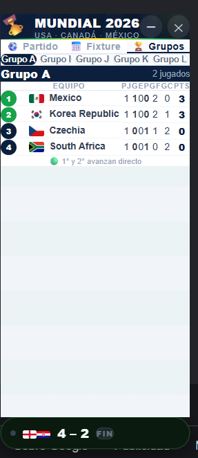
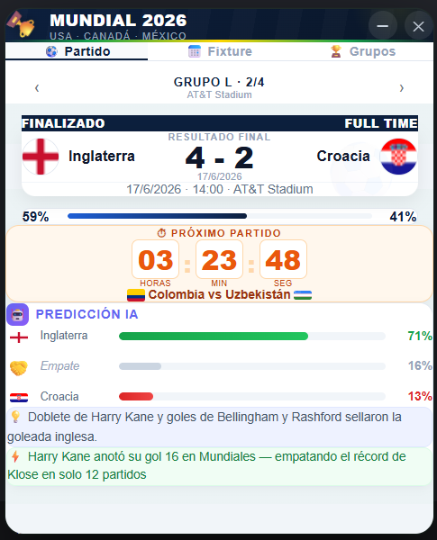
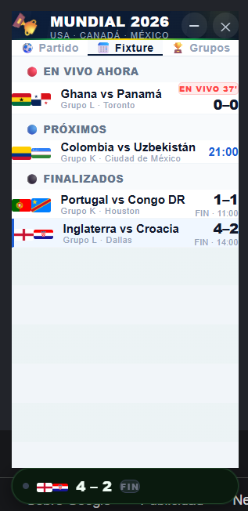
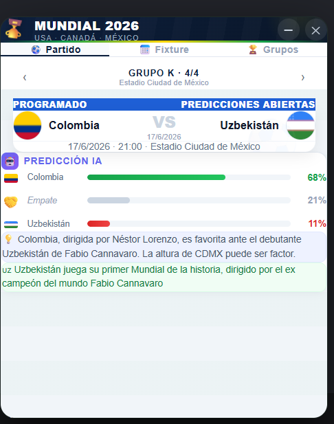
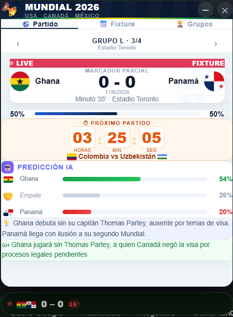
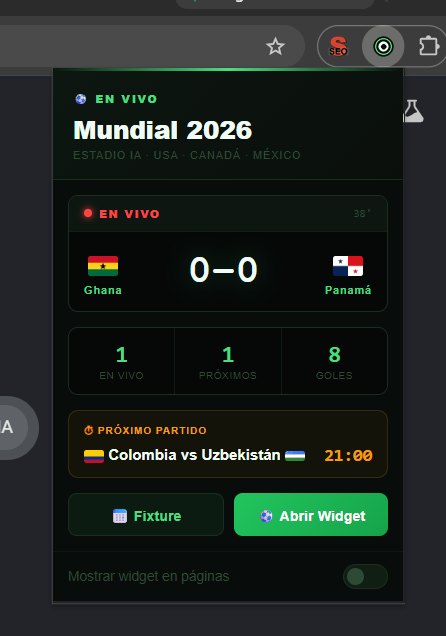

<div align="center">

# ⚽🏆 MUNDIAL 2026 

### El Mundial, sin salir de la pestaña en la que estás.


</div>

---

## 🟢 ¿Qué es esto?

Un **widget flotante** que se inyecta sobre cualquier página web — tu correo, YouTube, el classroom de la universidad, lo que sea — y te muestra **marcadores en vivo, predicciones de IA y tabla de grupos del Mundial 2026**, sin que tengas que abrir una nueva pestaña ni perder lo que estabas haciendo.

> 💡 Cierras la pestaña, sigues trabajando, y el partido sigue corriendo en una esquinita. Así de simple.

---

## 📸 Así se ve en acción

<table>
<tr>
<td width="50%">

**🔴 Partido en vivo**



</td>
<td width="50%">

**✅ Partido finalizado**



</td>
</tr>
<tr>
<td width="50%">

**🔵 Próximo partido + Predicción IA**



</td>
<td width="50%">

**📅 Fixture del día completo**



</td>
</tr>
<tr>
<td width="50%">

**🏆 Tabla de grupos en vivo**



</td>
<td width="50%">

**📍 Popup de la barra de Chrome**



</td>
</tr>
</table>

---

## ✨ Features

| | |
|---|---|
| 🏴 **Banderas reales** | Imágenes reales por país (no emoji — se ven igual en cualquier sistema operativo) |
| 🤖 **Predicción IA** | Probabilidad de victoria / empate / derrota con justificación en lenguaje natural |
| ⏱️ **Countdown en vivo** | Cuenta atrás hasta el próximo partido, segundo a segundo |
| 📊 **Minuto real** | El reloj del partido se calcula contra la hora real, no con un contador que se desincroniza |
| 🟢 **Estados con color** | Verde para victorias, rojo para EN VIVO 🔴, azul para PROGRAMADO 🔵 — de un vistazo sabes qué está pasando |
| 📋 **Tabla de grupos** | Posiciones, PJ, G, E, P, GF, GC y puntos — clasificados directos resaltados |
| 🌍 **Funciona en todas partes** | Se inyecta en cualquier página, sin excepciones |

---

## 🧱 Stack técnico

```
┌─────────────────────────────────────────────────┐
│  manifest.json          → Config Manifest V3      │
├─────────────────────────────────────────────────┤
│  background/worker.js   → Service Worker (JS)     │
│     · datos de partidos y grupos                  │
│     · chrome.alarms cada 60s                       │
│     · cálculo de minuto real                       │
├─────────────────────────────────────────────────┤
│  content/overlay.js     → Widget inyectado (JS)   │
│  content/overlay.css    → Estilos del widget       │
├─────────────────────────────────────────────────┤
│  popup/popup.html+js    → Popup barra Chrome        │
└─────────────────────────────────────────────────┘
```

**100% JavaScript vanilla.** Sin React, sin build step, sin `node_modules`. Lo que ves en el repo es exactamente lo que carga Chrome.

---

## 🪟 Las 3 "ventanas" de la extensión

### 1️⃣ El widget flotante — `content/`
Vive **dentro** de cada página que visitas (inyectado vía `content_scripts`, `matches: ["<all_urls>"]`). No es un iframe, es un `<div>` real construido con JavaScript. Tiene dos formas:

- 🟢 **Colapsado** → la píldora chiquita, siempre visible, esquina inferior izquierda
- 🔼 **Expandido** → el panel completo con 3 tabs (Partido · Fixture · Grupos), altura fija para que nunca "salte" de tamaño al navegar entre secciones

### 2️⃣ El popup — `popup/`
La ventana que aparece al hacer clic en el ícono de la extensión, junto a la barra de direcciones. Resumen rápido + switch para mostrar/ocultar el widget.

### 3️⃣ El cerebro — `background/`
Sin interfaz visual. Vive en segundo plano gestionando `chrome.storage.local`, actualizando el minuto real de los partidos en vivo cada minuto, y haciendo de mensajero entre el popup y el widget.

---

## 🚀 Instalación

```bash
# 1. Clona el repo
git clone https://github.com/shaniira/mundial-2026.git

# 2. Ve a chrome://extensions/
# 3. Activa "Modo desarrollador" (arriba a la derecha)
# 4. Click en "Cargar descomprimida"
# 5. Selecciona la carpeta del proyecto (donde está manifest.json)
```

¡Listo! Abre cualquier página y el ⚽ ya debería estar ahí abajo a la izquierda.

---

## ⚠️ Sobre los datos

Los partidos y la tabla de grupos se actualizan **manualmente** en `background/worker.js`. No existe (todavía) una API pública 100% gratuita y confiable dedicada al Mundial 2026 — así que por ahora, los datos están curados a mano para garantizar precisión.

---

---

<div align="center">

**Hecho con ⚽ para no perderse ni un minuto del Mundial 2026**

</div>
